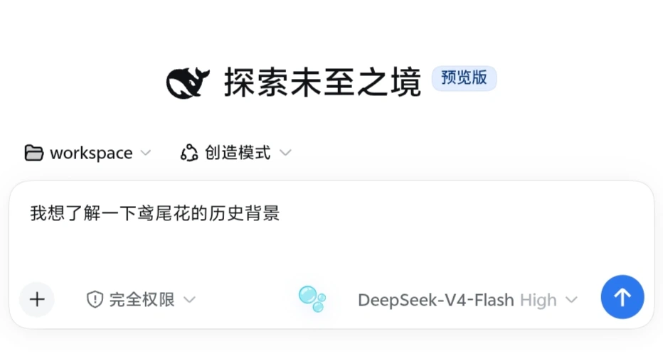
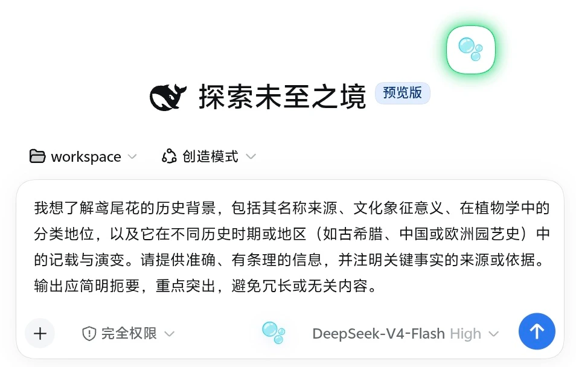
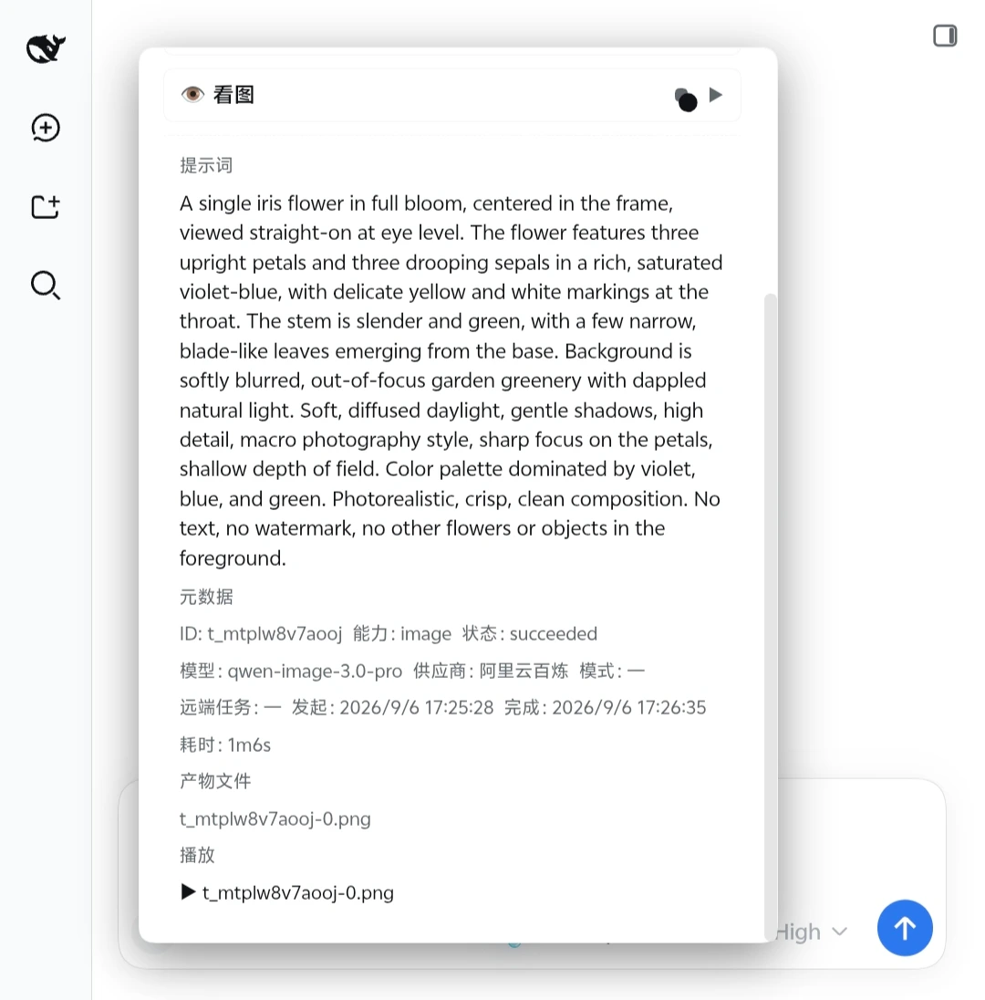
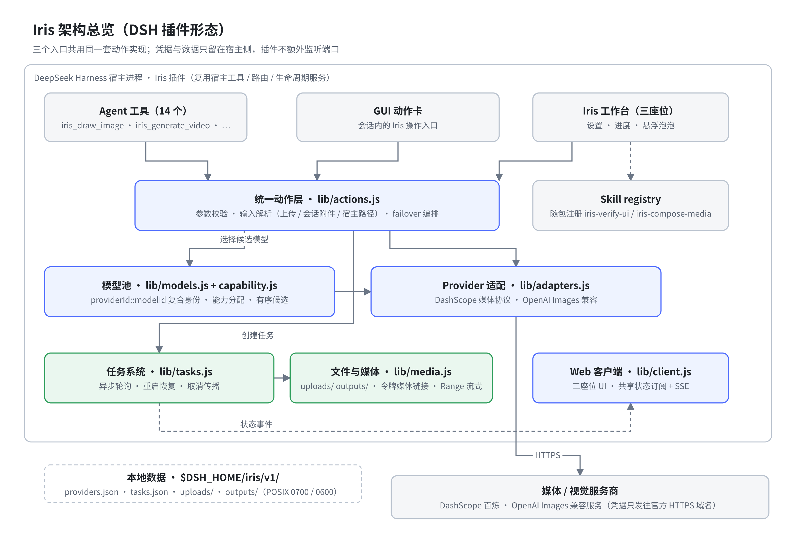
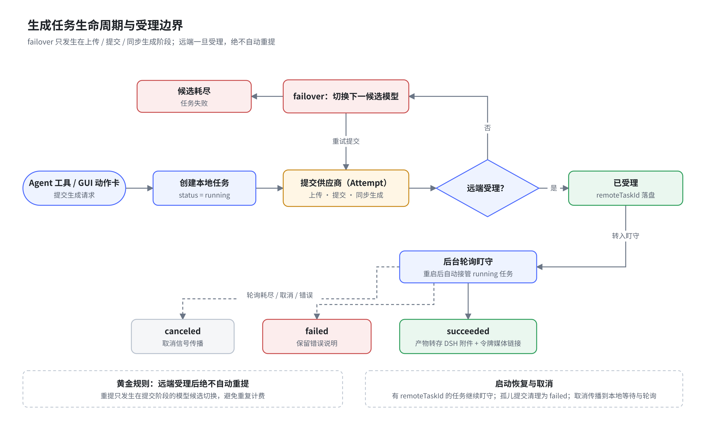
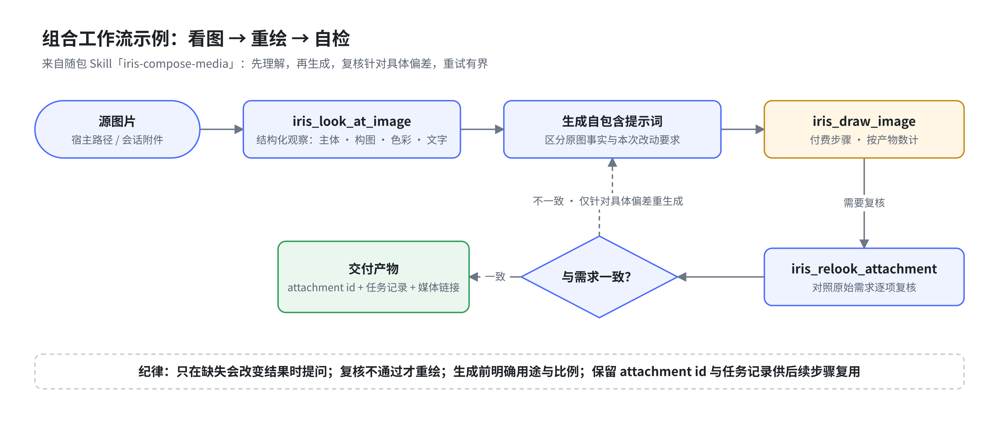

<p align="center">
  <sub>简体中文 | <a href="README.en.md">English</a></sub>
</p>

<p align="center">
  
</p>

<h1 align="center">Iris Media for DSH</h1>

<p align="center"><strong>Iris 多模态生产运行时 · 当前通过 DeepSeek Harness 插件使用</strong></p>

<p align="center">
  <a href="#deepseek-harness-适配"></a>
  <a href="https://www.npmjs.com/package/@mokuyoaxis/dsh-iris"></a>
  <a href="https://nodejs.org/"></a>
  <a href="https://github.com/mokuyoaxis/dsh-iris/actions/workflows/ci.yml"></a>
  <a href="LICENSE"></a>
</p>

dsh-iris 为 Agent 和 Iris 工作台提供图像、视频、语音与视觉理解能力，也能直接优化 DSH 对话框中的任意提示词。它可以连接 DashScope 百炼及 OpenAI Images 兼容服务；完整配置和任务管理集中在 Iris 工作台，右下角的 Iris 泡泡提供快捷入口。

## 实际生成示例

<p align="center">
  
</p>

> 从一句“鸢尾花”开始：Iris 对话框优化 Prompt（`deepseek-v4-flash`，thinking `off`）→ 阿里云百炼 `qwen-image-3.0-pro` 生成 · 2048×2048

## Android 16 真机界面

以下截图来自 Android 浏览器连接 Termux/PRoot Debian ARM64 中的 DSH，使用 DSH 默认皮肤；公开图片均已移除 EXIF/XMP/IPTC 元数据。

| 对话输入区的 🫧 入口 | 优化结果写回输入框 |
|---|---|
|  |  |

<p align="center">
  
</p>

> [查看完整六图流程：优化前、玻璃预览窗、写回、任务成功与实际产物](docs/screenshots.md)

项目目前处于早期版本，接口和配置格式仍可能随版本迭代调整。

Iris 的长期方向是可独立运行、可接入不同 Agent 宿主的媒体生产核心。DeepSeek Harness 是首个受支持宿主；当前版本仍需要 DSH，独立 Core、CLI 和工作台属于后续路线，尚未提供。

## 与 ai-paint 的关系

`ai-paint` 是 Iris 维护者本机未公开的前身项目，不是 Iris 的公开依赖，也不是用户需要下载、安装或自行创建的目录。没有该项目的用户直接按下文在 Iris 工作台配置供应商即可。

早期版本从维护者本机的 ai-paint 配置读取模型与凭据，既用于迁移前身项目，也让宿主进程可以在本地复用已有 API Key，避免为迁移而把密钥粘贴到 Agent 会话、命令行参数或文档中。0.1.1 将两者的配置彻底分离：Iris 只使用自己的配置；旧配置仅可通过把 `IRIS_IMPORT_WORKBENCH_CONFIG` 显式设为本地配置文件的绝对路径进行一次性导入，不会默认扫描 ai-paint，也不会在两边同步。该变量保存的是文件路径而不是 API Key，来源文件不会被修改；具体操作见[用户指南](user_guide.md#从旧工作台显式导入)。

## 最快开始

已经安装 DeepSeek Harness `0.1.2-rc.1` 且 `pnpm` 在 PATH 中时，把 Iris 加入 Web profile：

```bash
dsh plugin --profile web add @mokuyoaxis/dsh-iris
dsh web
```

> npm 上无 scope 的 `dsh-iris` 属于另一款插件。安装和更新 Iris Media 时必须保留完整包名 `@mokuyoaxis/dsh-iris`。

从当前源码目录试用时，把第一条命令中的 `@mokuyoaxis/dsh-iris` 换成 `.`。插件会在下一次 DSH 启动时装载，Web UI 默认位于 `http://127.0.0.1:3080`。

首次启动后，打开“设置 → Iris 工作台 → + 添加供应商”，填入 DashScope Base URL 和 API Key，再点“发现模型”。单供应商可以先使用自动能力分配。完整步骤、OpenAI Images 兼容配置和故障转移说明见[用户指南](user_guide.md)。

配置完成后，最小指令可以是：

```text
使用 iris_draw_image：画一只坐在蓝色窗边的白猫。
总结我刚上传的这张图片。
用 Iris 总结 /absolute/path/demo.mp4，再把摘要合成为语音。
```

DSH 的 profile 与插件命令由[官方安装说明](https://github.com/deepseek-ai/deepseek-harness/blob/master/docs/user/develop/basic/publish.md)定义。生成图片、视频或语音可能产生供应商费用。

## 功能概览



- 图像生成、文生视频、图生视频和 S2V 数字人视频
- 文本转语音与音频转写
- 看图问答、长图 OCR、目标定位、裁剪和像素差异分析
- 视频抽帧与多模态内容摘要
- 异步任务跟踪、重启恢复和带授权令牌的媒体播放
- 多供应商模型池，以及按 `供应商 + 模型` 分配能力
- 浏览器上传、会话附件和宿主路径三种文件来源
- 独立于工作台的对话框提示词优化，支持当前会话模型与 JSON 固定模型路由

## 使用前准备

- 满足所用 DeepSeek Harness 版本要求的 Node.js；dsh-iris 自身最低为 20.10
- 一个可用的 DeepSeek Harness 环境，以及 PATH 中的 `pnpm`
- 至少一个受支持的媒体或视觉服务供应商
- 使用视频抽帧和视频摘要时，需要系统提供 `ffmpeg` 与 `ffprobe`

安装插件后，在 Iris 工作台中添加供应商并为所需能力分配模型。供应商密钥保存在宿主侧的 Iris 配置中；POSIX 系统上 Iris 自有目录和文件分别收紧为 `0700` 与 `0600`，界面和接口不会返回完整密钥。Windows 的 mode 不等同于 ACL，仍需依赖当前用户目录和系统账户权限。

## DeepSeek Harness 适配

dsh-iris 按 DeepSeek Harness 插件形态提供服务端与 Web 客户端入口：服务端注册 14 个 Agent 工具，并复用宿主的工具、路由和生命周期服务；客户端通过 DSH 模块加载器接入设置页、会话输入区和全局悬浮层。插件不会启动独立服务或额外监听端口。

当前自动化测试覆盖插件装载、工具注册、客户端槽位和路由行为。0.1.1 已在 Linux ARM64 的干净与真实 Web profile 中，使用 DSH `0.1.2-rc.1`、Node.js `22.23.2` 完成宿主烟测；浏览器启动图、完整组合 bundle、Iris 客户端工厂和当时的三个 UI 座位均已验证。0.1.2 新增的第四个提示词优化座位已在 Android 浏览器真机确认渲染，配置读取、真实会话模型优化（实际 thinking `off`）、预览写回、独立关闭与重新启用，以及从短草稿到图片生成任务成功的闭环均已验证；浏览器端取消和 JSON 操作已有自动化 HTTP/配置覆盖，尚待补充真机逐项记录。Iris 自身仍以 Node.js `>=20.10` 为最低基线。

Iris 0.1.1–0.1.2 明确支持 DSH `>=0.1.2-rc.1 <0.1.3-0`，不再兼容 0.1.0/0.1.1 的旧客户端 Runtime。DSH 仍在快速演进，后续预览版须经验证后再扩大范围；兼容徽章不代表官方认证。若 DSH 要求更高 Node 版本，以 DSH 为准。

## 工具

### 生成、语音与任务

| 工具 | 用途 |
|---|---|
| `iris_draw_image` | 根据提示词生成图片 |
| `iris_generate_video` | 生成文生视频、图生视频或 S2V 数字人视频 |
| `iris_speak_text` | 将文本合成为语音 |
| `iris_transcribe_audio` | 将音频转写为文本 |
| `iris_task_status` | 查询单个任务或最近任务的状态和产物 |

### 视觉与图像处理

| 工具 | 用途 |
|---|---|
| `iris_look_at_image` | 对图片提问并获得视觉模型回答 |
| `iris_relook_attachment` | 使用新问题重新查看会话中的图片附件 |
| `iris_long_ocr` | 分块识别长截图或长图文字 |
| `iris_locate` | 定位图片中的目标并返回像素坐标 |
| `iris_crop` | 按像素区域裁剪图片 |
| `iris_pixel_diff` | 比较两张图片并生成差异统计和热力图 |
| `iris_html_screenshot` | 在受限环境中将 HTML 字符串渲染为截图 |

### 视频处理

| 工具 | 用途 |
|---|---|
| `iris_video_frames` | 从视频中均匀抽取画面帧 |
| `iris_media_summarize` | 结合画面帧和可选音频转写生成视频摘要 |

## 文件输入

Iris 支持三种文件来源，推荐顺序如下：

1. **浏览器上传**：适合本地文件和跨环境访问，单文件上限为 64 MB。
2. **会话附件**：适合复用当前会话中已经上传或生成的媒体。
3. **宿主路径**：适合宿主可以直接读取的大文件。这里填写的是宿主进程看到的路径，不一定等同于浏览器所在系统的路径。

上传内容保存在 `$DSH_HOME/iris/v1/uploads/`，默认保留 7 天。不同系统下的路径选择建议见[文件访问与跨环境](docs/file-access-across-environments.md)。

## 对话框提示词优化

Iris 会在 DSH 对话输入区提供一个无边框、无文字的“🫧”入口，不需要打开 Iris 工作台。点击后打开带背景模糊、半透明层次和柔和光影的玻璃悬浮窗；桌面端靠近输入区显示，窄屏与 Android 浏览器自动切换为带安全区和内部滚动的底部面板，避免遮挡、溢出或控件挤叠。它只读取当前未发送的纯文本草稿，并提供通用、图片、视频和首尾帧视频四种目标模板；结果先预览，用户确认后才写回输入框，不会自动发送。含 `@` 或 `/` 结构化引用的草稿暂不改写，以免引用身份丢失。

默认使用当前会话选中的主模型；会话尚未选定模型时回退到 DSH 默认模型。优化请求不携带聊天历史、工具、附件或工作区，只发送当前草稿与目标模板。为避免推理模型在正文前耗尽生成预算，默认 `generation.reasoningEffort` 为 `off-if-supported`：仅在 DSH 模型元数据明确支持关闭 thinking 时禁用推理，否则使用供应商默认值，并且不再继承主会话的 High/Low 档位。可在 JSON 中改为 `provider-default`、`inherit` 或模型声明的具体 effort ID；成本与稳定性优先时，建议使用 `fixed` 路由指定轻量非思考模型。用户也可以导出 `prompt-optimizer.json`，将 `route.mode` 改为 `fixed` 并指定其他已在 DSH 注册的 `provider` 与 `model`，然后从面板重新导入。面板提供“恢复默认”，可还原 Iris 内置 Prompt、目标模板、会话模型路由和生成参数。该对话入口可以单独关闭，并从 Iris 工作台重新启用；关闭不会停用工作台、Agent 工具或任务后台。优化调用可能产生对应文本模型的费用。

## 模型分配与故障转移

能力分配使用 `providerId::modelId` 作为模型身份。同名模型如果来自不同供应商或不同账号，会被视为两个独立选项。

生成类能力可以配置多个候选模型。Iris 只会在上传、提交或同步生成阶段失败时尝试下一个候选项；远端服务一旦受理任务，就不会自动重新提交，以免产生重复任务或重复计费。已经受理的异步任务由任务系统继续跟踪。



转写是独立的 `transcribe` 能力，不会占用 TTS 或视觉能力的模型配置。

## 组合工作流示例

Iris 自带两个 Agent Skills（`iris-verify-ui` 与 `iris-compose-media`），把多个工具编排成有界、可复核的媒体工作流。下例是「看图 → 重绘 → 自检」：先理解原图，再生成，复核针对具体偏差，只有复核通过才交付。



图的 SVG 版本与可编辑 drawio 源文件位于 [`docs/assets/diagrams/`](docs/assets/diagrams/)。

## 数据与任务

运行数据默认位于 `$DSH_HOME/iris/v1/`：

| 位置 | 内容 |
|---|---|
| `providers.json` | 供应商和能力分配，文件权限为 0600 |
| `prompt-optimizer.json` | 用户导入的优化 Prompt、目标模板、模型路由和生成参数，文件权限为 0600 |
| `tasks.json` | 任务元数据和附件索引，最多保留 500 条 |
| `outputs/` | 生成和处理后的媒体文件 |
| `uploads/` | 浏览器上传的临时输入副本 |

0.1.1 首次装载时会收紧既有 `$DSH_HOME/iris/v1/` 树的 POSIX 权限，不修改文件内容，也不跟随符号链接。大媒体下载采用流式私有临时文件与原子替换，不再把整段视频载入内存。

异步任务会在后台轮询。插件重启后，可以继续接管仍在远端执行的任务。取消信号会传递到本地等待与轮询流程；是否能取消远端计算，取决于供应商接口。

音频和视频通过带随机令牌的 Iris 媒体链接访问。图片会尽量转存为 DSH 持久附件，方便在会话中继续使用。

## 安全说明

- 供应商密钥不会通过状态接口返回。
- DashScope 媒体协议只允许把密钥发送到阿里云官方 HTTPS 域名；其他 Base URL 默认推断为 OpenAI Images 兼容协议。
- `/iris/*` 默认只接受回环 Host；LAN 或反向代理必须显式设置 `IRIS_TRUSTED_HOSTS`，修改状态的请求还会检查跨站来源。
- `IRIS_TRUSTED_HOSTS` 不是认证机制。对公网或不可信网络开放 DSH 时，必须在反向代理或宿主层配置身份认证与 HTTPS。
- 模型实测只按单项能力运行，并在真实供应商调用前确认；视频和转写不会用空样本自动提交付费探针。
- HTML 截图在不具备同源权限的沙箱页面中渲染，脚本和外部网络默认不可用。
- 媒体链接使用随机能力令牌，文件路径只从任务记录解析。
- Iris 不提供独立账号体系，多用户隔离和访问控制由 DeepSeek Harness 部署负责。

## 已知限制

- `sharp` 包含原生组件；主要支持 glibc Linux、Windows 和 macOS。裸 Termux 等非标准运行环境可能需要额外处理。
- 视频抽帧和视频摘要依赖系统安装的 `ffmpeg` 与 `ffprobe`。
- HTML 截图不加载远程脚本、字体或图片；需要的资源应先内联。
- WSL、容器和远程部署中，浏览器路径通常不能直接交给宿主读取，请优先上传文件。
- 供应商返回的模型清单只是候选集合，模型是否真正支持某项能力仍以实际调用为准。

## Agent Skills

插件启用时会通过 DSH Skill registry 自动注册两个随包 Skill：

| Skill | 适用场景 |
|---|---|
| [`iris-verify-ui`](.dsh/skills/iris-verify-ui/SKILL.md) | 组合截图、语义检查、元素定位、裁剪和像素比较，完成有证据的 UI 验收 |
| [`iris-compose-media`](.dsh/skills/iris-compose-media/SKILL.md) | 组合两个以上 Iris 工具，完成看图后绘图、图片转视频、视频总结配旁白或 S2V 等媒体工作流 |

从 0.1.2 起，只要宿主提供 DSH Skill registry，普通 npm 安装用户在任意项目目录中都能发现并加载它们，不需要克隆本仓库或另外配置 Skill 搜索目录。项目目录中存在同名 Skill 时，仍按 DSH 原生优先级使用项目版本；Skill registry 不可用时，14 个 Iris 工具仍可独立装载。

## 开发与验证

在项目目录运行：

    npm test

测试覆盖配置合并、模型身份、任务生命周期、生成动作、HTTP/SSE 路由、客户端交互和安全边界。项目采用 ES Modules，不需要构建步骤。

测试调度使用 Node.js，逐文件启动独立进程，首个失败即停止，不依赖 Bash；临时目录使用系统 API 并在退出时清理。GitHub Actions 定义 Linux/Windows × Node.js 20.10/22 矩阵，发布前钩子会重新运行完整测试。原生 Windows/WSL 的 DSH 宿主烟测仍待实机验证。

发布由 `v*` 标签触发 `.github/workflows/release.yml`：跑完整测试后打包，用工作流内置 `GITHUB_TOKEN` 创建 GitHub Release（附 tarball，发布说明取自 CHANGELOG 对应章节），并在配置了 `NPM_TOKEN` secret 时发布到 npm。本机无需任何 GitHub 凭据。

## 文档

- [用户指南](user_guide.md)
- [变更记录](CHANGELOG.md)
- [路线图](docs/ROADMAP.md)
- [文件访问与跨环境](docs/file-access-across-environments.md)
- [Android 16 真机截图画廊](docs/screenshots.md)

## License

[MIT](LICENSE)
