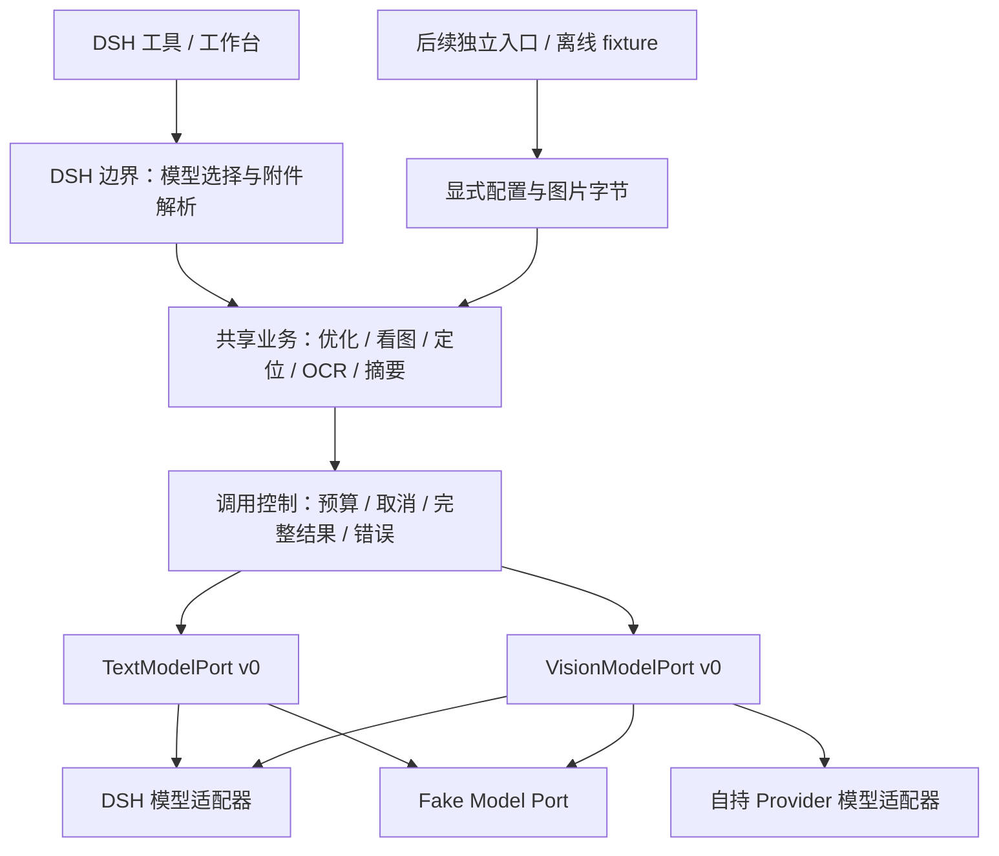

# Text/Vision Model Port v0 契约设计

状态：**2026-09-30，M1 纯契约、调用控制与 Fake Text/Vision Port 已实现；真实适配器及消费者尚未迁移。** 本文约定共享层与模型适配器的边界；现有 `textModel.stream()`、`visionModel.analyze()`、视觉后端与提示词优化器仍使用原实现。M1 不增加公开 export、CLI 命令、配置字段或生产依赖，也不改变 [Host Adapter v0](HOST_ADAPTER_CONTRACT.md) 的现有方法。

## 目标与范围

共享层负责一次文本或视觉调用的输入校验、预算、取消、完整结果与安全错误。DSH 与自持 Provider 只适配协议；提示词优化、看图、定位、OCR 和媒体摘要消费同一调用语义。

v0 只支持单轮、无工具的完整文本结果。视觉请求携带一张图片；多帧摘要先由业务层制作一张 contact sheet。会话历史、工具调用、音频、视频、实时流式 UI 与结构化输出协议留到后续单独设计。定位的 bbox JSON 和 OCR 的分块结果仍由对应业务模块解析，不成为通用模型端口的数据结构。

这些操作不属于媒体生成 Task：端口不创建 Task/Attempt/Artifact，不占 Core writer 租约，不接入 Provider Task Runner。后续若需要保存文字结果，应另行通过显式 Command 设计产物交付。



图中是目标结构。独立文本 Provider 与新 Headless 命令不在本轮范围；当前自持 Provider 目录尚无 `text` 能力。

## 职责归属

| 层 | 拥有的职责 | 交给下一层的输入 |
|---|---|---|
| 入口 / Host 边界 | 读取配置、固定或会话/默认模型选择、解析附件与文件、预览和写回草稿 | 已绑定端口、文字、图片字节、预算、取消信号 |
| 共享业务 | 模板、目标类型、bbox 解析、OCR 分块、contact sheet、操作整体调用预算 | 单轮请求与单次调用预算 |
| 共享调用控制 | 通用校验、deadline、结果验证、安全错误、显式候选策略 | 已验证请求与合成信号 |
| 模型适配器 | 凭据和端点闭包、请求映射、底层流聚合、终态识别、资源清理 | 完整文本或稳定错误 |
| Host 投影 | 附件、工具输出、健康反馈、UI 文案 | 对用户有用的结果 |

共享模块不得导入 DSH/Cordis、`config-store.js`、Host Runtime 或 Store，不读取环境配置，不取得原始 `ctx`。DSH 模型适配器只接收已探测的 Host Port；原始 DSH 对象仍封闭在已有 Host Adapter 与插件装配边界。

## 端口与版本

两种端口均提供同步、纯读取的 `describe()` 与异步 `complete(request, options)`。v0 不向消费者暴露原始事件流；适配器可以在内部使用流，并在收到正常终态后返回完整结果。

以下 TypeScript 描述内部契约形状，不是已发布类型声明：

```ts
type Support = 'supported' | 'unsupported' | 'unknown';

type ModelIdentity =
  | { origin: 'provider'; backendId: string; providerId: string; modelId: string }
  | { origin: 'host'; backendId: string; providerId?: string; modelId?: string };

type ModelDescriptor = {
  contractVersion: 0;
  kind: 'text' | 'vision';
  identity: ModelIdentity;
  availability: 'available' | 'unavailable' | 'incompatible';
  reasonCode?: string;
  features: {
    system: Support;
    temperature: Support;
    maxOutputTokens: Support;
    reasoning: Support;
  };
  reasoning?: { off: Support; effortIds?: string[] };
  image?: { mediaTypes?: string[]; maxBytes?: number };
};

type Reasoning =
  | { mode: 'provider-default' }
  | { mode: 'off' }
  | { mode: 'effort'; effortId: string };

type TextRequest = {
  prompt: string;
  system?: string;
  generation?: {
    temperature?: number;
    maxOutputTokens?: number;
    reasoning?: Reasoning;
  };
};

type VisionRequest = TextRequest & {
  image: { bytes: Uint8Array; mediaType: string };
};

type TextCallOptions = {
  signal?: AbortSignal;
  budget: {
    timeoutMs: number;
    maxInputTextBytes: number;
    maxOutputChars: number;
  };
};

type VisionCallOptions = {
  signal?: AbortSignal;
  budget: TextCallOptions['budget'] & { maxImageBytes: number };
};

type ModelCompletion = {
  contractVersion: 0;
  text: string;
  finishReason: 'stop';
  identity: ModelIdentity;
  usage?: {
    inputTokens?: number;
    outputTokens?: number;
    totalTokens?: number;
    reasoningTokens?: number;
  };
};

interface TextModelPort {
  describe(): ModelDescriptor & { kind: 'text' };
  complete(request: TextRequest, options: TextCallOptions): Promise<ModelCompletion>;
}

interface VisionModelPort {
  describe(): ModelDescriptor & { kind: 'vision' };
  complete(request: VisionRequest, options: VisionCallOptions): Promise<ModelCompletion>;
}
```

契约版本独立于 Host Adapter 版本。`lib/model-port-contract.js` 验证端口、请求、描述与结果；未知字段、错误类型或不兼容版本应明确拒绝。端口是只包含 `describe` / `complete` 的方法对象；DTO 拒绝额外字段、accessor 和非普通对象原型。能力列表只接受密集的自有数据元素，不读取元素 getter、不调用自定义 iterator。标识长度最多 256 code units，命名空间化 `backendId` 最多 512，组件需使用安全字符或百分号编码。描述与结果中的对象只包含安全 DTO；端口方法与 `AbortSignal` 不可序列化，也不进入任何记录。

`describe()` 只读取已绑定或缓存的事实，返回独立、可序列化的快照；不得联网、调用模型、保存附件、探测账号或写健康状态。未知能力保留 `unknown`，不能猜测为 supported 或 unsupported。`reasonCode` 是受控诊断码，不透传供应商异常原文。

## 模型绑定与能力

端口在一次业务操作开始时绑定后端。`backendId` 使用命名空间，例如 `iris-provider:<id>`、`dsh-text:<id>`、`dsh-vision:default`；DSH 的 provider/model ID 与 Iris 的 `providerId::modelId` 是不同命名空间，不能互相猜测转换。

自持 Provider 必须有明确的 Provider 与模型身份。DSH 固定选择或可解析的当前选择应记录已知身份；全局视觉默认模型若无法解析，只声明 Host 后端，省略未知 `providerId`/`modelId`。不得用文本默认模型冒充视觉模型，也不得承诺宿主内部动态路由每次选到相同物理模型。

`availability=available` 表示本地依赖与协议形状可调用，不表示凭据有效、模型具备看图能力或远端一定成功。真实视觉实测仍是显式模型调用，可能产生费用；它使用同一预算与取消机制。普通 describe/Doctor 不做该实测。

`kind='text'|'vision'` 是共享端口的调用类型，不是新增持久 Provider 能力标签。当前目录只声明媒体生成、转写和视觉能力；不能从模型名或 `vision` 标签推导 `text`。首个文本消费者使用 DSH 或显式注入的 Fake Text Port。增加自持文本目录、配置或 CLI 选择能力应另行审查，不在迁移中顺带改写现有配置。

## 输入与生成控制

- `prompt` 必须是非空字符串，`system` 若提供也必须非空；用 trim 判断空白，但端口不改写原文。业务层负责当前功能已有的修剪、JSON 数据包装与模板选择。
- 文本大小按 `prompt` 与 `system` 的 UTF-8 字节总和检查。`maxOutputChars` 按 JS 字符串长度（UTF-16 code unit）计算，与当前提示词优化器一致；不能按 token 数替代。
- 视觉输入必须是非空字节和规范化 MIME，不接受路径、URL、data URL、Artifact ID 或 DSH attachment/session 对象。入口解引用并解码；业务层制作的 OCR 分块或 contact sheet 也以字节传入。
- v0 图片 MIME 范围为 `image/png`、`image/jpeg`、`image/webp`、`image/gif`；适配器可以声明更小范围。声明限制与调用预算取更严格者。未知远端限制不伪造数值；格式不支持要返回稳定错误，不能丢掉图片继续纯文本调用。
- 字节在调用期间只读，消费者不得复用后修改；适配器若异步保留或转码，需持有安全副本。图片来源和宿主引用留在入口，不进入通用错误或结果。
- 预算必须显式传入；时间、文本、图片和输出上限均为正的有限安全整数。超限在模型调用前拒绝，输出超限在读取过程中中止；不能截取前若干字再返回成功。
- `temperature` 为有限非负数，具体范围由绑定协议校验；`maxOutputTokens` 为正安全整数。不支持的显式参数在调用前拒绝；未知能力不能静默丢弃参数，必须由已验证协议映射，否则返回 unsupported。
- `reasoning` 缺省等于 `provider-default`；`off` 必须有明确的关闭能力，`effort` 必须在已声明 effort 列表中。适配器不推测厂商字段，也不把思考正文作为结果文本。

提示词优化的 `off-if-supported` 与 `inherit` 是业务策略，不成为通用请求字段：前者在已知支持关闭时映射为 `off`，否则 `provider-default`；后者只继承入口明确选择的 effort。当前 `off/none/disabled/disable/no-thinking` 等供应商元数据只在 DSH 适配边界归一化。模型元数据解析使用操作信号与总 deadline，不在 `describe()` 中触发网络查询。

迁移保留已有业务预算：提示词草稿 32 KiB、输出 16,000 code units、默认 45 秒与 1,200 输出 token，原配置范围不变。草稿上限仍在业务层校验；端口的总文本上限需按草稿上限、JSON 转义的最坏增长与已验证模板上限计算，不能把带模板的整个请求限制为 32 KiB，导致原本合法的草稿被拒绝。

视觉单次调用沿用 120 秒默认档，Host 原 6,000 字限制改为超限失败。其他入口需明确其文字/图片上限，不能直接套用生成任务的图片参数校验。v0 不为这些预算增加持久配置格式。显式 effort 在元数据未知时从直接透传变为调用前拒绝，是待实施的契约收紧；M2 必须覆盖配置与 inherit 路径，不能声称行为完全未变。

## 完整结果与底层流

成功只返回 `finishReason='stop'` 且 trim 后非空的完整正文。端口保留正文原样，业务层决定展示或解析时是否 trim；结果身份来自本次真实绑定或明确的 Host 不透明后端。

正文按本次请求返回调用方，可能复述用户输入，例如优化后的提示词或 OCR 文字；这是显式结果，不是诊断字段。共享层不自动记录输入/正文，也不把它们复制到能力快照、错误、健康元数据或 Core 记录。

适配器必须处理底层完整性：

1. 正常结束原因需有已验证语义。SSE `[DONE]`、EOF、退出迭代或已经读到文字均不能单独证明正常完成；非流式协议需确认完整响应与终态。
2. DSH `text-delta` 聚合为正文；`block-end` 的完整文本替换同一块的累积值，不能再追加导致重复。旧 `delta` 只有在同一协议存在可验证终态时才兼容。
3. `length/max-tokens`、本地输出上限、工具调用、内容阻断、未知终态、解析失败、流中断和流错误均拒绝成功，即使已读到部分正文。不得把 partial text 伪装成完成结果。
4. 不返回原始块、事件、thinking、工具参数、HTTP headers/body 或 Host live object。底层 cleanup 后才能完成正常调用；取消路径按下一节处理。
5. usage 只填供应商实际提供且语义已知的非负安全整数；未知字段省略，不能补零、推算 token 或把思考 token 重复加到总数。

现有 `adapters.visionStream()` 与 Host `visionModel.analyze()` 只返回字符串，不足以证明正常结束；实现时必须增强协议读取，不能仅套一层 wrapper 就宣称符合 v0。缺少终态的既有 SSE fixture 也需要改为真实协议形状。

## 取消、超时与调用次数

一次 `complete()` 最多调用一次上游模型生成入口，不自动重试或切换后端。DSH 内部的调度/重试事实未知时应如实说明；“调用 Host 一次”不等于已证明远端绝对只执行一次。

调用前先检查取消；已取消时零图片准备、零模型调用。调用期间的合成信号覆盖图片桥接、HTTP/Host 请求与流读取，deadline 从调用开始计时。成功返回前再次检查信号；已经取消或超时的晚到结果不能覆盖错误。

取消时向底层传递 abort，结束流迭代、释放 reader，移除监听器并清理 timer。超时也必须触发 abort；不能只用 `Promise.race` 返回超时而放任底层继续。本地应在 deadline 后有界退出；若第三方不响应信号，则丢弃晚到结果、处理晚到拒绝并报告本地取消，不宣称远端执行或计费已经停止。没有可验证信号传递/流清理路径的适配器不能标为符合 v0。

业务操作另有整体预算 `{ timeoutMs, maxInvocations }`，两者均为正的有限安全整数；该预算属于共享调用控制，不作为额外字段传给模型端口。整体 deadline 覆盖路由解析、图片处理、OCR 所有块及候选切换。每次调用只能消费剩余时间与次数，不能为每一块重置总预算。取消/超时立即停止整次操作；OCR 不得把它记录成普通失败块后继续请求后续图片。

看图或提示词优化等单次业务默认 `maxInvocations=1`；OCR 应按已规划的块数设置有限基础预算，若允许候选切换，再显式给出总调用上限与整体 deadline，不沿用单次调用的默认次数。保留视觉有序候选时，由共享调用策略显式给出候选、总次数和允许的错误条件：

| 上次结果 | 可否进入下一候选 |
|---|---|
| 本地校验错误、取消、超时 | 停止；不能通过换模型掩盖请求问题或取消 |
| 能力缺失/不兼容/不支持且 `not_invoked` | 显式策略可跳过，无模型调用 |
| 明确认证、限额或速率拒绝且 `rejected` | 显式策略可继续；仍计入调用次数 |
| 正常结束但正文为空且 `responded` | 仅策略明确允许时继续；前次可能已计费 |
| 已读部分正文、截断、工具调用、内容阻断、协议错误或调用事实未知 | 停止，不自动重提 |

`maxInvocations` 统计实际进入上游生成入口的次数；跳过不可用候选不消耗次数，但候选表必须有限。适配器没有自己的候选列表。此处是文本/视觉调用策略，不借用媒体 Task 的 `accepted/not_accepted`，也不把错误分类当作免费调用证明。

整体调用次数用尽后不得进入下一次生成，返回 `IRIS_MODEL_CALL_LIMIT`；OCR 可以在业务层将此前成功块投影为明确的 partial 结果，但不能宣称全部完成。取消或超时仍立即终止操作，不通过 partial 结果隐藏。

## 错误契约

错误使用 `ModelPortError`，只暴露受控字段：

```ts
type ModelPortErrorRecord = {
  code: string;
  message: string;  // 固定或经过白名单映射的安全说明
  stage: 'validate' | 'prepare' | 'invoke' | 'read' | 'normalize';
  invocation: 'not_invoked' | 'rejected' | 'responded' | 'unknown';
  backendId?: string;
  status?: number;  // 已验证的 HTTP 状态码；未知时省略
};
```

| code | 含义 |
|---|---|
| `IRIS_MODEL_INPUT_INVALID` | 字段、类型、预算或输入大小非法 |
| `IRIS_MODEL_UNAVAILABLE` | 未配置或缺失依赖/Host 图片桥接能力 |
| `IRIS_MODEL_INCOMPATIBLE` | 端口版本或底层协议形状不兼容 |
| `IRIS_MODEL_UNSUPPORTED` | 当前模型/协议不支持显式输入或生成参数 |
| `IRIS_MODEL_AUTH_FAILED` | 明确认证或权限拒绝 |
| `IRIS_MODEL_RATE_LIMITED` | 明确速率或额度限制 |
| `IRIS_MODEL_REQUEST_FAILED` | 其他请求失败；网络异常不推定未调用 |
| `IRIS_MODEL_PROTOCOL_INVALID` | 无法解释的响应/事件/终态 |
| `IRIS_MODEL_INCOMPLETE` | 流结束但缺少可验证的正常终态 |
| `IRIS_MODEL_OUTPUT_LIMIT` | 本地输出超限或远端 token 截断 |
| `IRIS_MODEL_CALL_LIMIT` | 操作整体生成调用次数已用尽 |
| `IRIS_MODEL_EMPTY_RESULT` | 正常结束但正文为空 |
| `IRIS_MODEL_UNEXPECTED_TOOL` | 收到工具调用或工具结束原因 |
| `IRIS_MODEL_CONTENT_BLOCKED` | 明确内容阻断/拒答终态 |
| `IRIS_MODEL_ABORTED` | 调用方或上层操作取消 |
| `IRIS_MODEL_TIMEOUT` | 单次或整体 deadline 到期 |

`invocation` 只描述本地可确认的调用事实：未进入生成入口为 `not_invoked`；上游明确拒绝为 `rejected`；收到有效生成内容/终态为 `responded`；进入入口但无法确认结果为 `unknown`。网络失败、在途取消和超时不能回写为 `not_invoked`。收到部分正文后中断仍为 `responded`，但调用失败。它不是账单事实或持久 Task 状态。

不提供通用 `retryable` 布尔值。是否切换候选由上述策略同时检查 code 与 invocation；同一个错误码可发生于不同调用阶段。

安全错误不包含 Prompt、图片、凭据、端点、签名 URL、会话/附件标识、绝对路径或原始异常 cause。上层可给出预算数值等安全上下文，但不能直接拼接供应商错误原文。`ModelPortError` 不复用依赖 Task 受理/持久化语义的 Provider Error Record。

## DSH 图片与结果桥接

当前 Host 视觉实现只消费 attachment 引用，忽略 `imageDataUrl`。新适配器必须保证模型实际收到共享请求里的同一张图：

1. 已验证 DSH 支持内联图片时，在适配边界转换字节；
2. 否则使用 Attachments Port 保存相同字节，取得 Host 引用，再调用 Host 模型；该步骤受同一信号、deadline 与图片预算约束；
3. 若两者都不可用，调用模型前返回 `IRIS_MODEL_UNAVAILABLE`，禁止退化成只有问题的纯文本请求。

Host 引用、session ID 与 source metadata 可存在于 DSH 适配器闭包，但不能进入共享请求、结果或诊断快照。桥接不得创建 Core Artifact；宿主是否持久保存附件需在实现与 canary 中明确记录，不能把这条路径称为完全零副作用。

提示词优化仍由 DSH 边界读取 v1 配置、解析固定/会话/默认模型，返回选择来源供 UI 展示。共享核心只接收选定端口与模板；保留原草稿、预览后写回和不携带会话历史的行为。Provider 健康反馈由入口消费安全结果/错误，模型端口不导入健康 Store。

## 实现切片与退出条件

M1 已完成。以下其余切片仍为实施建议，不要求一次跨模块改造；提示词优化的功能定位与输入隔离继续讨论，M2 未获本轮实施授权。

| 切片 | 范围 | 退出条件 |
|---|---|---|
| M1：纯契约与调用控制（已实现） | `model-port-contract.js`、`model-invoker.js`、test-only Fake Text/Vision Port | 无 Host/配置/Store 依赖；请求、错误、预算与取消 conformance 通过 |
| M2：首个文本消费者 | DSH 模型适配器与纯 `prompt-optimizer-core.js`；原优化入口保留配置/选择/投影 | 真实 DSH 流 fixture 与 Fake Port 结果一致；reasoning、预览/写回、取消、零 Task 写入回归通过 |
| M3：视觉单次调用 | 自持协议适配器、DSH 图片桥接、look/relook | 真正检查终态；同图字节进入两后端；取消后零下一候选；Host 可选降级如实诊断 |
| M4：复合视觉业务 | locate、OCR、contact-sheet summarize | bbox 与分块语义保持；整体预算有效；取消停止后续块；摘要仍默认一张拼图一次调用 |
| M5：独立入口 | 再决定文本目录、显式 Headless 选择和产物交付 | 先审查配置/公开面；无 DSH tarball 消费者与真实 Provider 单独举证 |

`model-http-adapter.js` 和 `dsh-model-adapter.js` 可作为协议映射的实现位置，最终命名由实施切片决定。现有 `vision.js` 的有序候选可以渐进接入共享调用策略；共享代码不反向导入旧 Host 实现。媒体摘要的 Core 抽帧接线与 S2V/Browser 迁移另行处理。

## M1 内部调用方式

- `modelPortSnapshot()` 取得严格描述；`normalizeModelCall()` / `normalizeModelCompletion()` 校验输入和完整结果；`modelErrorRecord()` 只输出受控字段，不信任普通 Error 的原始 code、message 或 status。
- `invokeModel(port, request, options)` 用于单次调用，自动释放 deadline 和监听器，没有候选切换。
- `createModelOperation({ signal?, budget: { timeoutMs, maxInvocations? } })` 用于有总预算的复合操作；次数缺省 1。`operation.signal` 可覆盖入口解析与图片准备；`invoke()` 共用总额度，取消或任一调用超时后整个操作停止。
- `operation.runCandidates(ports, request, options, policy)` 只消费有限的端口数组；`skipUnavailable`、`allowRejected`、`allowEmptyResult` 均缺省 false。策略只允许前文矩阵中的错误组合，不能通过放宽策略重试未知结果、截断、工具调用或取消。
- 复合操作在 `finally` 中调用 `operation.dispose()`；`snapshot()` 只返回次数、在途数和本地生命周期，不包含请求或结果。并发调用先预留次数，只有可信契约错误明确 `not_invoked` 才返还，普通 Error 不能伪造未调用。
- `createModelTextCollector()` 是协议无关的正文辅助工具，支持 append/replace、读取时输出上限和正常终态；`fail(error)` 在流错误后保留已收到正文的事实，错误进入终态后不再接受新的 stop。具体适配器先映射自身事件；该辅助工具不理解 DSH 或 SSE 协议，也不提供公共流接口。

`tests/fixtures/fake-model-port.mjs` 可复现正常正文、规范化流、准备失败、在途错误、等待取消与迟到结果；`model-conformance.mjs` 的同一组 17 项检查分别消费 Text/Vision。fixture 和输入记录只在测试进程存在，不进入 npm 包。

所有共享调用通过调用控制执行；协议适配器负责将 abort 传递到真实源及清理资源。当前 M1 的完整性与取消证据来自 Fake Port，不代表现有 HTTP/DSH 协议已经符合新契约。

现有配置版本、公开接口和全部消费者不应在一个提交中同时切换。M1 不提供对提示词内容的语义过滤或注入防护证明；优化系统的主动模板/约束加入和不可信输入隔离，需在后续业务设计中分别验证。

## 必须补齐的 conformance

M1 已执行纯契约、调用控制与 Fake Port 路径。后续协议/业务测试仍需要执行真实适配/消费路径，不能仅比较 DTO 或检查源码字符串。

| 场景 | 必须证明的结果 |
|---|---|
| describe、能力快照与 Doctor | 零模型/网络调用、零配置/Task/Artifact 写入；未知能力不猜测 |
| 非法输入、格式、预算、reasoning | 在生成入口前拒绝；显式参数不静默丢弃 |
| 预先取消 | 零附件桥接、零生成调用 |
| 在途取消、超时与晚到结果 | 底层收到 abort，资源清理，本地有界退出，无下一候选/下一 OCR 块 |
| delta 与 block-end | 不重复文字；只有可验证正常终态才返回完整正文 |
| EOF、`[DONE]` 但无终态、坏 JSON、未知终态 | 稳定失败，部分正文不返回为成功 |
| 空结果、token 截断、输出超限、工具调用、内容阻断 | 独立错误；切换行为符合显式策略与总次数 |
| OCR 与候选组合 | 有限总调用数与整体 deadline；普通块失败可形成明确 partial 业务结果，取消/超时终止操作 |
| DSH 图片桥接 | 保存/内联的字节与输入相同；缺桥接时零模型调用，无引用泄漏 |
| 模型身份与 usage | DSH 与 Iris 命名空间不混用；未知默认身份和 usage 字段省略 |
| 错误、快照与自动记录 | 不包含输入、Key、端点、路径或 Host 对象；正文只作为显式结果返回，无隐式 Task/Artifact 写入 |
| 两类适配器与业务入口 | Fake Port、HTTP 协议 fixture、DSH 流 fixture 消费同一组结果/错误规则 |

当前 `tests/vision-backend.mjs` 明确允许预先取消后继续 Host fallback，当前 OCR 捕获取消后继续分块，视觉实测超时也只是 race。它们是待修行为，未来切换时应更新测试并留下先失败后修复的证据。M1/Fake Port 通过不等于这些消费者门禁已通过。
