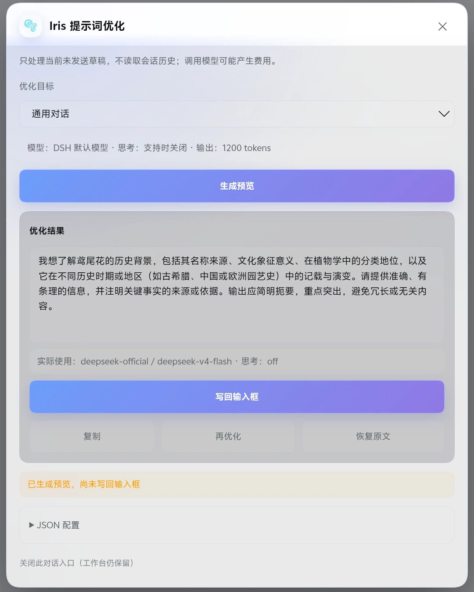
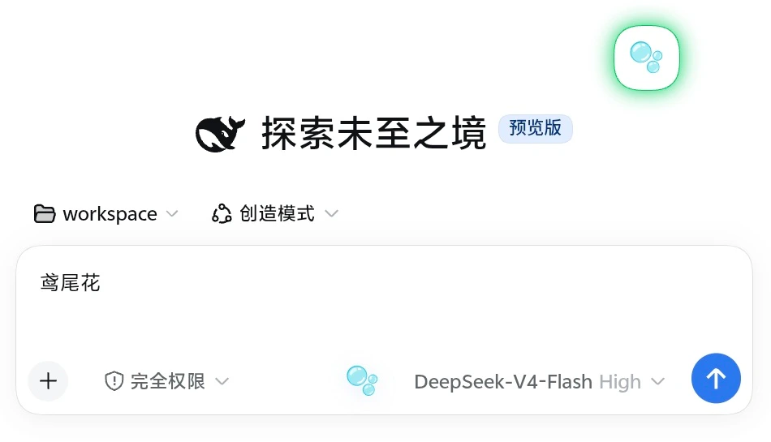
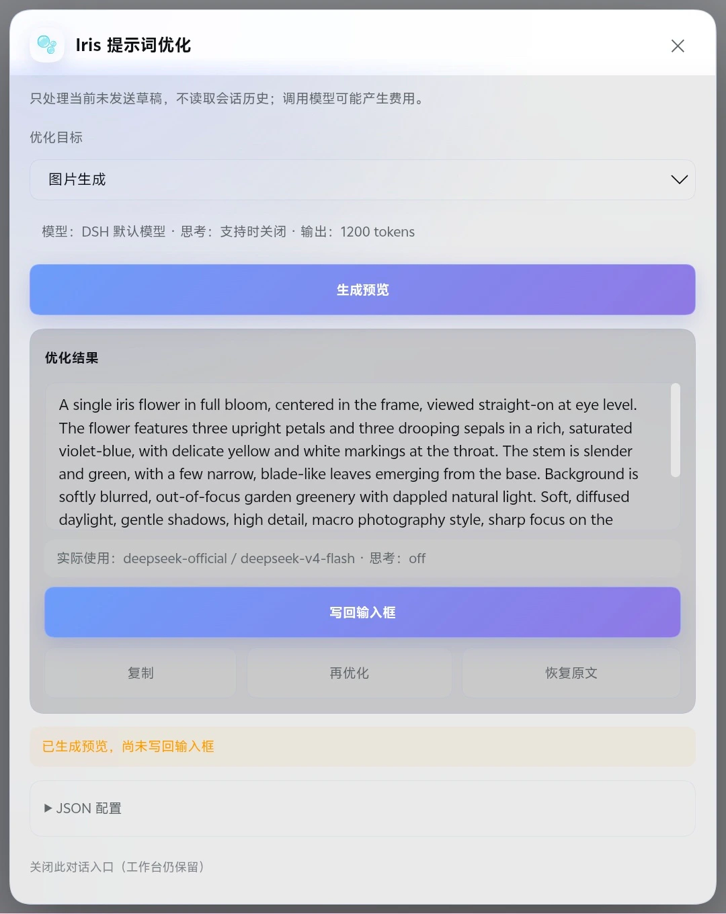

# Iris Android 真机截图 / Android screenshots

这些画面来自 Android 16 浏览器，访问运行在 Termux/PRoot Debian ARM64 中的 DSH；界面使用 DSH 默认皮肤。截图与生成图均为 2026-09-06 的真实操作结果，公开副本已重新编码并移除 EXIF、XMP 与 IPTC 元数据。

These captures were taken in an Android 16 browser connected to DSH running under Termux/PRoot Debian ARM64, with the default DSH skin. They show real interactions from 2026-09-06. Public copies were re-encoded without EXIF, XMP, or IPTC metadata.

## 通用提示词优化 / General prompt optimization

| 优化前 / Before | 优化预览 / Preview |
|---|---|
|  |  |

优化结果只会先进入预览。点击“写回输入框”后，Iris 更新当前草稿，但不会自动发送消息。

## 图片生成闭环 / Image-generation loop

| 一句话草稿 / Short draft | 图片 Prompt 预览 / Image prompt preview |
|---|---|
|  |  |

优化后的 Prompt 写回输入框并交给 DSH Agent 后，Iris 使用阿里云百炼的 `qwen-image-3.0-pro` 完成生成任务。任务详情和实际产物如下。

| 成功任务 / Succeeded task | 实际产物 / Generated artifact |
|---|---|
|  |  |

原始草稿：`鸢尾花`

提示词优化模型：`deepseek-official / deepseek-v4-flash`，实际思考档位 `off`
图片生成供应商与模型：阿里云百炼 / `qwen-image-3.0-pro`

截图中的任务 ID 是本地任务标识，不是媒体访问令牌；画面不包含 API Key、账户信息、私有绝对路径或认证 URL。
